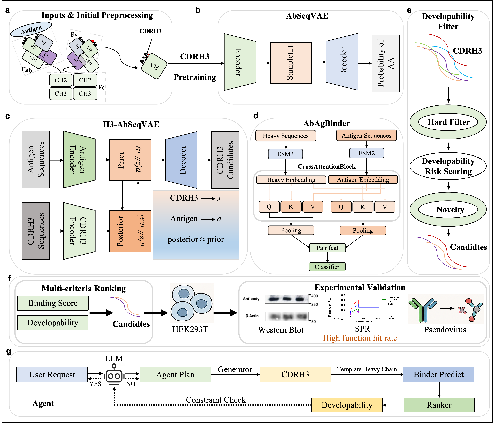

# An interpretable deep learning framework for antigen-guided antibody generation and binding prediction

<p align="center">
  
</p>

The framework combines:

- CDRH3 VAE pretraining
- Conditional generation from antigen sequences
- ESM2 cross-attention binding prediction

## Hardware Requirements

The experiments in this repository were conducted on a Linux server with the following hardware:

- GPU: NVIDIA A100
- CPU: ≥8 cores
- RAM: ≥32 GB
- Storage: ≥20 GB free disk space

The code can run on a single GPU.

### Estimated GPU Memory Usage

| Model | GPU Memory |
|------|------------|
CDRH3 VAE | ~4–6 GB |
Conditional CDRH3 VAE | ~6–8 GB |
ESM2 Cross-Attention Binding Model | ~10–14 GB |

### Minimum Requirements

The code can also run on smaller GPUs (e.g., RTX 2080) by reducing:

- 'batch_size'
- 'max_heavy_len'
- 'max_antigen_len'

## System Requirements

### Operating System

The code has been tested on:

- Ubuntu 20.04
- Linux-based HPC environments

### Python

Python version:

- Python ≥ 3.9

### Python Dependencies

Major Python libraries used in this project:

- PyTorch ≥ 2.0
- Transformers ≥ 4.30
- scikit-learn
- pandas
- numpy
- matplotlib
- seaborn
- ANARCI (for CDRH3 extraction)

## Installation

To install the required packages for running the code, use the following command:

pip install -r requirements.txt

## How to Train and Use H3-AbSeqVAE

This repository provides scripts for training models, generating antibody CDRH3 sequences, and performing downstream analysis.

## 1. Train the Models

### Train CDRH3 VAE

To pretrain the variational autoencoder on CDRH3 sequences:

```bash
python code/train/train_cdrh3_vae.py
```

Train Conditional CDRH3 VAE

To train the conditional VAE for antigen-conditioned CDRH3 generation:

```bash
python code/train/train_conditional_cvae.py
```

Train Binding Prediction Model

To train the antibody–antigen binding prediction model based on ESM2 and cross-attention:

```bash
python code/train/train_esm2_cross_attention.py
```

Variant-split experiment (WT/Beta/Alpha → Delta test):

```bash
python code/train/train_esm2_cross_attention_targetsplit.py
```

2. Generate CDRH3 Sequences from Antigens

After training the conditional VAE, candidate CDRH3 sequences can be generated using:

```bash
python code/train/generate_cdrh3_from_antigen.py
```

Generated sequences and predicted binding scores will be saved to:

```bash
data/processed/
```

3. Run Analysis

Various analysis scripts are provided to study the learned latent space and generated sequences.

Extract Latent Representations
```bash
python code/analysis/extract_latent_vectors.py
```
Latent Space Visualization
```bash
python code/analysis/compare_latent_pca.py
```
Length Prediction Analysis
```bash
python code/analysis/analyze_length_head.py
```
CDRH3 Similarity Heatmap
```bash
python code/analysis/cdrh3_similarity_heatmap.py
```

Output Files

Generated results and intermediate outputs are stored in:

```bash
data/processed/
```

Examples include:

latent embeddings

generated CDRH3 sequences

predicted binding scores

### Contact

If you have any questions about this repository, please contact:

**Fanxu Meng**  
Email: [f.meng@vu.nl](mailto:f.meng@vu.nl)
