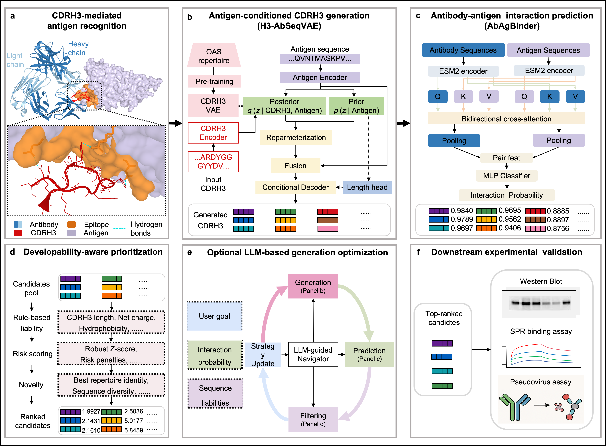

# SPACE
### A Unified Framework for Multi-Constraint Antigen-Specific Antibody Design in Sequence Space

SPACE is a sequence-based platform for antigen-specific antibody design that integrates:

- **H3-AbSeqVAE**: antigen-conditioned CDRH3 sequence generation
- **AbAgBinder**: antibody–antigen interaction prediction
- **Developability-aware screening**: candidate prioritization using sequence-derived developability metrics and novelty-aware ranking

## Overview
<p align="center">
  
</p>

# Installation

Clone the repository:

```bash
git clone https://github.com/Fanxu-alt/SPACE-antibody-design.git
```

Enter the project directory:

```bash
cd SPACE-antibody-design
```

Create the conda environment:

```bash
conda env create -f environment.yml
```

Activate the environment:

```bash
conda activate space
```

Alternatively, install the required packages manually:

```bash
pip install -r requirements.txt
```

Verify the installation:

```bash
python -c "import torch; print(torch.__version__)"
```

# Quick Start
## 1. Generate antigen-specific antibody candidates

Prepare an antigen FASTA file:

```text
>Spike
MFVFLVLLPLVSSQCVNL...
```

Generate 1,000 antigen-conditioned CDRH3 sequences:

```bash
python code/inference/generate_antibodies.py \
    --antigen antigen.fasta \
    --num 1000 \
    --output results/generated_candidates.csv
```

Output:

```text
results/generated_candidates.csv
```

containing

- generated CDRH3 sequences
- heavy-chain sequences
- candidate identifiers

## 2. Predict antibody–antigen interaction probability

Evaluate generated antibodies using AbAgBinder:

```bash
python code/inference/predict_binding.py \
    --input results/generated_candidates.csv \
    --checkpoint checkpoints/best_esm2_cross_attention.pt \
    --output results/binding_prediction.csv
```

Output:

```text
results/binding_prediction.csv
```

including

- binding probability
- binding logits
- predicted interaction score

## 3. Evaluate developability

Run the developability assessment:

```bash
python code/inference/evaluate_developability.py \
    --input results/generated_candidates.csv \
    --output results/developability.csv
```

Output:

```text
results/developability.csv
```

including

- hard-filter pass/fail
- developability risk score
- liability annotations

## 4. Multi-objective candidate ranking

Combine binding prediction and developability assessment:

```bash
python code/inference/rank_candidates.py \
    --binding results/binding_prediction.csv \
    --developability results/developability.csv \
    --output results/final_ranked_candidates.csv
```

Output:

```text
results/final_ranked_candidates.csv
```

containing

- overall ranking
- binding probability
- developability score
- novelty score
- final recommendation

# Reproducing the Figures

All figures reported in the manuscript can be reproduced using the scripts under

```text
code/plot/
```

Examples:

```bash
python code/plot/plot_pretraining.py
```

```bash
python code/plot/plot_binding_prediction.py
```

```bash
python code/plot/plot_generalization.py
```

# Training

## Train H3-AbSeqVAE

```bash
python code/train/train_cdrh3_vae.py
```

## Fine-tune antigen-conditioned CVAE

```bash
python code/train/train_conditional_cvae.py
```

## Train AbAgBinder

```bash
python code/train/train_esm2_cross_attention.py
```

### Online Web Application

https://antibody-design.vercel.app

## Pretrained Models

The repository includes:

```text
checkpoints/best_esm2_cross_attention.pt
```

This checkpoint was trained using:

```text
esm2_t12_35M_UR50D
```

for demonstration and reproducibility purposes.

Larger checkpoints trained with:

```text
esm2_t33_650M_UR50D
```

are available through Google Drive:

- best_esm2_cross_attention.pt
- best_esm2_cross_attention_regression.pt
- best_esm2_cross_attention_regression_fixed_antigen.pt

Downloads:

- https://drive.google.com/file/d/14ZK1tzs6QaPVj8i74B2Rzhb3JpxOE25r/view?usp=drive_link,
- https://drive.google.com/file/d/1ZZQzJYHQ37Zc1KjwqAsiiYMyB8yyORGY/view?usp=drive_link,
- https://drive.google.com/file/d/1SdkpORkcsUErk5c2iiNBYlkyTVKrbPLN/view?usp=drive_link.

After downloading, place the files in:

```text
checkpoints/
```

### Main Dependencies

- PyTorch
- Transformers ≥ 4.30
- FastAPI
- Uvicorn
- NumPy
- Pandas
- Scikit-learn
- Matplotlib
- Seaborn
- OpenAI API
- ANARCI (for CDRH3 extraction)

## Dataset Availability

### Repertoire Pretraining Dataset

The file:

```text
covid_human_heavy_cdr3_aa_unique_len4_30.txt
```

contains a non-redundant collection of human SARS-CoV-2-associated heavy-chain CDRH3 sequences derived from the Observed Antibody Space (OAS) database.

Processing steps:

1. Removal of empty entries
2. Removal of non-canonical amino acid characters
3. Global deduplication
4. Retention of sequences between 4 and 30 amino acids

Download:

https://drive.google.com/file/d/1n46ld31QrC9oYlZVsR7JZsoOgX_TFupc/view?usp=drive_link.

### Antigen-Specific Datasets

Antibody–antigen complexes were collected from the SAbDab database for:

- HIV gp120
- HIV gp160
- Influenza Hemagglutinin (HA)
- Influenza Neuraminidase (NA)
- Plasmodium Circumsporozoite Protein (CSP)

Processed datasets are available under:

```text
data/raw/
```

For each complex, IMGT-numbered CDRH3 sequences were extracted.

Negative samples were generated using a dissimilarity-based sampling strategy with a sequence identity threshold below 60%.

## License

This project is released under the MIT License.

See the LICENSE file for details.

## Contact

**Fanxu Meng**

Email: f.meng@vu.nl
